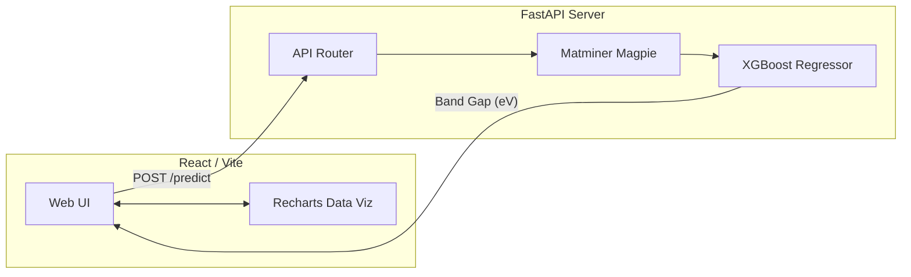

# ☀️ Solar Band Gap Prediction System

[](https://www.python.org/downloads/)
[](https://fastapi.tiangolo.com)
[](https://reactjs.org/)
[](https://xgboost.readthedocs.io/)
[](https://opensource.org/licenses/MIT)

A professional-grade, full-stack machine learning application designed to predict the **Band Gap ($E_g$)** of Perovskite crystals. 

By analyzing chemical formulas through advanced featurization (`matminer`), this system identifies materials that fall within the "Goldilocks" band gap range (1.1 eV to 1.4 eV), accelerating the discovery of highly efficient materials for next-generation solar cells.

---

## 🚀 Key Features

*   **Real-time ML Inference:** Instantly predict band gaps from raw chemical formulas (e.g., `CsPbI3`, `CH3NH3PbBr3`).
*   **Intelligent Categorization:** Automatically classifies materials into efficiency tiers (Optimal, Low Gap, High Gap).
*   **Interactive Dashboard:** A sleek React-based UI featuring prediction history, data visualization (using Recharts), and material analysis.
*   **Production-Ready Backend:** A highly concurrent FastAPI server built for fast, scalable model serving.
*   **Automated Deployment:** Infrastructure as Code (IaC) ready with a `render.yaml` blueprint.

---

## 🏗️ Architecture



## 🛠️ Tech Stack

**Data Science & ML**
*   **XGBoost:** Gradient boosted decision trees for robust regression.
*   **Matminer:** Domain-specific material science featurization (Magpie preset).
*   **Pandas & NumPy:** Data wrangling and transformation.
*   **Scikit-Learn:** Cross-validation and model evaluation.

**Backend & API**
*   **FastAPI:** Asynchronous web framework for serving the ML model.
*   **Uvicorn:** ASGI web server implementation.
*   **Pydantic:** Data validation and serialization.

**Frontend**
*   **React 18 (Vite):** Component-based UI rendering.
*   **Recharts:** Composable charting library for React.
*   **React Router:** Client-side navigation.

---

## 🔬 The Machine Learning Pipeline

Our model relies on a rigorous data science pipeline (`Backend/Train.py`) to ensure high accuracy and generalization:

1.  **Data Filtering:** Removes metals (Band Gap < 0.1 eV) to focus strictly on semiconductors.
2.  **Chemical Featurization:** Converts string formulas (e.g., `MAPbI3`) into numerical features representing electronegativity, radii, and valence using `matminer`'s Magpie preset.
3.  **Target Transformation:** Applies a `log1p(x)` transformation to the target band gap to normalize the distribution and prevent large insulators from skewing the model.
4.  **Hyperparameter Tuning:** Utilizes `GridSearchCV` with 3-Fold Cross-Validation to optimize `n_estimators`, `learning_rate`, and tree depth.
5.  **Target Metrics:** Achieves an RMSE (Root Mean Squared Error) of **< 0.7 eV**.

---

## 💻 Getting Started (Local Development)

### Prerequisites
*   Node.js (v18+)
*   Python (3.12+)

### 1. Backend Setup

```bash
# Navigate to the backend directory
cd Backend

# Create and activate a virtual environment
python -m venv venv
source venv/bin/activate  # On Windows use `venv\Scripts\activate`

# Install dependencies
pip install -r requirements.txt

# Start the FastAPI server
python app.py
```
*The API will be available at `http://localhost:8000`*

### 2. Frontend Setup

```bash
# Navigate to the frontend directory
cd Fend

# Install dependencies
npm install

# Start the development server
npm run dev
```
*The UI will be available at `http://localhost:3000`*

---

## 🌍 Deployment

### Backend (Render)
The backend is configured for 1-click deployment on [Render](https://render.com) using the included `render.yaml` blueprint.
1. Push this repository to GitHub.
2. In the Render Dashboard, click **New +** -> **Blueprint** and select your repository.
3. Render will automatically provision the environment, install dependencies, and start `uvicorn`.

### Frontend (Vercel)
The frontend is optimized for [Vercel](https://vercel.com).
1. Connect your repository to Vercel.
2. Set the Root Directory to `Fend`.
3. Add an Environment Variable: `VITE_API_URL` pointing to your deployed Render Backend URL (e.g., `https://your-api.onrender.com`).
4. Click Deploy.

---

## 📡 API Reference

#### `POST /predict`
Predicts the band gap for a given chemical formula.

**Request Body:**
```json
{
  "formula": "CsPbI3"
}
```

**Response:**
```json
{
  "formula": "CsPbI3",
  "predicted_band_gap": 1.3402,
  "is_optimal": true,
  "efficiency_category": "Optimal for Solar Cells",
  "confidence_range": {
    "lower": 1.1402,
    "upper": 1.5402
  }
}
```

#### `GET /model_info`
Returns training metadata, hyperparameters, and features used by the active XGBoost model.

#### `GET /dataset` *(Optional)*
Paginates through the raw training dataset (if the dataset file is present).

---

## 📁 Project Structure

```text
SolarBandGapPrediction/
├── Backend/
│   ├── app.py                  # FastAPI Application
│   ├── Train.py                # ML Pipeline & Training Script
│   ├── DataCollecttion.py      # Dataset aggregration logic
│   ├── requirements.txt        # Pinned Python dependencies
│   ├── SolarB_Gap_Pred.pkl     # Serialized XGBoost Model
│   └── Features.pkl            # Serialized Matminer Featurizer
├── Fend/
│   ├── src/                    # React Source Code
│   │   ├── pages/              # Routing pages (Home, Predictions, About)
│   │   ├── App.jsx             # Main Router Component
│   │   └── main.jsx            # React DOM Entry
│   ├── package.json            # Node dependencies
│   └── vite.config.js          # Vite build config
├── render.yaml                 # Infrastructure as Code (Render)
├── .gitignore                  # Git exclusions
└── README.md                   # Project Documentation
```

## 📄 License
This project is for academic, research, and portfolio purposes. 
